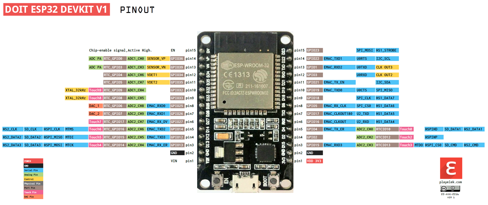
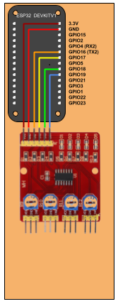
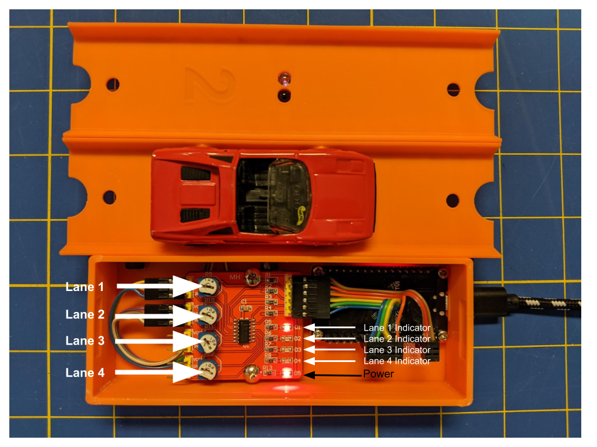

# Diecast Remote Raceway - Finish Line

This folder contains the 3D models, software and instructions for the
Finish Line component of the Diecast Remote Raceway.

## 3D Printed Components

### Finish Lanes

The Finish Lane design is derived from the Starting Box design by 
[capsurfer](https://www.thingiverse.com/capsurfer/about) on 
[Thingiverse](https://www.thingiverse.com/thing:4026846).  His sketch for
the profile of the track was re-used as the basis for the profile
for the finish line.  The cut-outs for the track connectors are similarly
based on capsurfer's sketches in his original Fusion360 design.  All other
aspects are my own creation.


* Controller-Box.stl - Box to house the ESP32 development board and Infrared Tracking Sensor Module
* Controller-Lid.stl - Solid lid to Controller-Box
* Controller-Lid-Adjust.stl - Controller-Box lid with viewing window and access holes for adjusting sensitivity
* Track-1.stl - Finish line for lane 1
* Track-2.stl - Finish line for lane 2
* Track-3.stl - Finish line for lane 3
* Track-4.stl - Finish line for lane 4
* Track-Bottom-Cover.stl - Snap-on cover for wiring on lane

#### License

Since I started with a sketch from capsurfer's Starter Box, the Starting Gate components are released under 
the same [Creative Commons Attribution - NonCommercial - ShareAlike](https://creativecommons.org/licenses/by-nc-sa/4.0/) license.

## Hardware



The wiring to connect the ESP32 dev board to the YWBL-WH Infrared Tracking Sensor Module is shown below:



I used a 6 pin Dupont connector for the YWBL-WH header and two right angle crimp-on connectors to connect to
the ESP32. The ribbon cable was split to accommodate two right angle connectors: a two pin connector for Vcc and
GND, and a *5 pin* connector to connect the four lane sensors to GPIO16 through GPIO19.  Note that the middle
pin of the 5 pin connector that would connect to GPIO05 is not connected.

### Lane Sensitivity Adjustment
The Starting Gate and Finish Line detect cars by infrared light reflected off the bottom of the car.  As such,
they are sensitive to ambient infrared light striking the sensor.  If the sensors are exposed to high levels of
ambient infrared lighting, such as in direct sunlight, they may report a car when none is present.  The
sensitivity of each Finish Line can be adjusted.



The LED labeled “D5” is a power indicator.  It will illuminate whenever power is applied to the Finish Line.

Adjustments are made with a small screwdriver using the four trim potentiometers labeled “Lane 1” through
“Lane4” in the above photo.  When correctly adjusted, the lane indicator LED will be unlit when no car is
present in a lane and will light up when a car is placed over the sensor.  To adjust, make sure the Finish Line
is plugged into a 5V power source.  Start with no car present.  Turn the white potentiometer corresponding to
the lane until the indicator lights up.  Then turn back just past the point where the light turns off.  Test the
lane by placing a car over the sensor.  The corresponding indicator should illuminate.

## Software Updates

In the initial implementation, the Finish Line checked for software updates on every restart.  This required
bringing up the WiFi interface, connecting using a SSID and password stored in config, fetching the most recent
release version number and comparing it to the version running.  If a newer version was available, it would be
downloaded and run.

This had two problems.  First, it unnecessarily brought up the WiFi interface and lengthened the
(already too long) startup time even when there was no software update. Second, it required
storing a fair amount of configuration data in SPIFFS that is difficult to update.  While you CAN
set config values over bluetooth using the SETC command, it's not exactly convenient. If setting
the WiFi config values, it would send the WiFi password unencrypted over Bluetooth - something I'm
loath to do!

The update check has since been moved to the Starting Gate. If the Starting Gate has a WiFi
connection, once it has established a Bluetooth connection to the Finish Line, it sends a FLVS
command to retrieve the Finish Line Version String. The Starting Gate then checks if an update
is available.  If so, it sends a UPFW command to the Finish Line telling it to update its firmware.
The UPFW command passes a JSON argument containing the WiFi SSID, an encrypted password/pks
string and the URL of the updated software image.

In order to encrypt the WiFi password, the Starting Gate requests a RSA public key
from the Finish Line via the GKEY command.  In response to the GKEY command, the Finish Line generates
a 2048 bit random RSA key pair and returns the public key in PEM format. The Starting Gate uses this
public key to encrypt the WiFi password before sending it as part of the JSON argument to the
UPFW command.

The only remaining configuration variable maintained in SPIFFS is the Bluetooth advertisement
string which defaults to "FinishLine".  The only reason to change this value is if you are
running multitrack races where both tracks are connected to the same WiFi. I did this
extensively when developing the software. For example, if you wanted to set the Bluetooth
advertisement on a Finish Line to "FinishLine2," you can use the sendcmd.py script in the 
StartingGate's 'util' directory:

```console

% ./sendcmd.py 'SETC bluetoothAdvertisement=FinishLine2'

```

and update the corresponding FINISH\_LINE\_NAME config in the Starting Gate that you want
to connect to the Finish Line.
