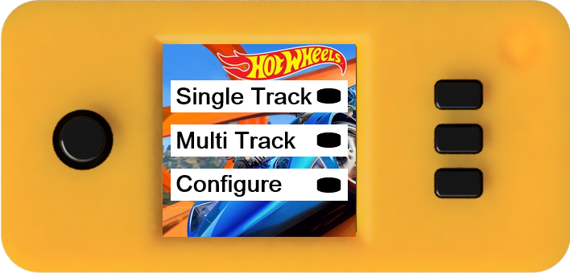
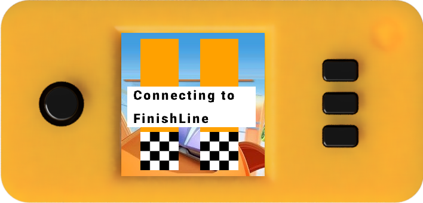
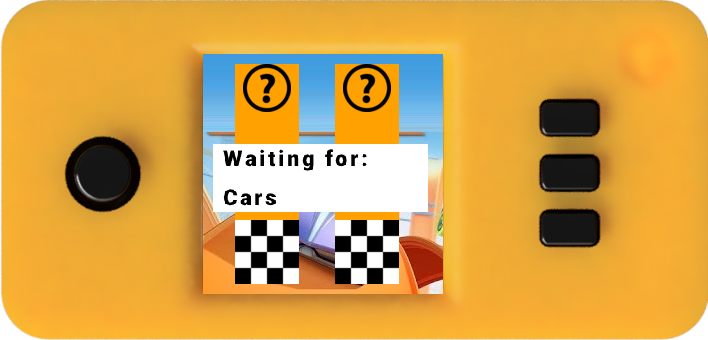

# Diecast-Remote-Raceway
The Diecast Remote Raceway (DRR) allows participants to race 1:64 scale die-cast cars (such as the popular Hot Wheels® cars from 
[Mattel](https://www.mattel.com/en-us)), head-to-head, from remote locations.  A DRR consists of an automated Starting Gate, an electronic Finish Line, and a web service that coordinates races between multiple raceways via the internet.

## Operation

Start by mounting the Starting Gate onto a suitable elevated surface. The mount on the bottom of
the Starting Gate can be attached to a [Hot Wheels Clamp
3-way](https://www.thingiverse.com/thing:4037458) to clamp onto a chair, desk, shelf or other
surface.  Alternatively, you can attach to a photography tripod using a [Hot Wheels Track Tripod Connector ](https://www.thingiverse.com/thing:4376073).

Next, attach track sections to build a track of your liking.  Terminate the track with the Finish
Line component.

Apply power to both the Starting Gate and Finish Line using 5 Volt sources and mini-USB cables.
Most phone chargers or power packs work well to provide power.  When the Starting Gate has
completed its initialization, the display should look like this:

* To race locally, push the button next to "Single Track"
* To race against another track, push the button next to "Multi Track"
* To set configuration parameters such as selecting car icons, other tracks to race against, tack timeout or WiFi parameters, push the button next to "Configure"

Once a race mode has been selected (Single Track or Multi Track) the
Starting Gate will establish a Bluetooth connection to the Finish Line.
This may take a minute or more to complete, during which time the following
is displayed:

Once connected to the Finish Line, the Starting Gate awaits cars in each starting gate.

WORK IN PROGRESS

Complete race instructions about car placement, how the starting gate resets at the
completion of a race.  Start next race simply by placing cars in the gates, etc.
