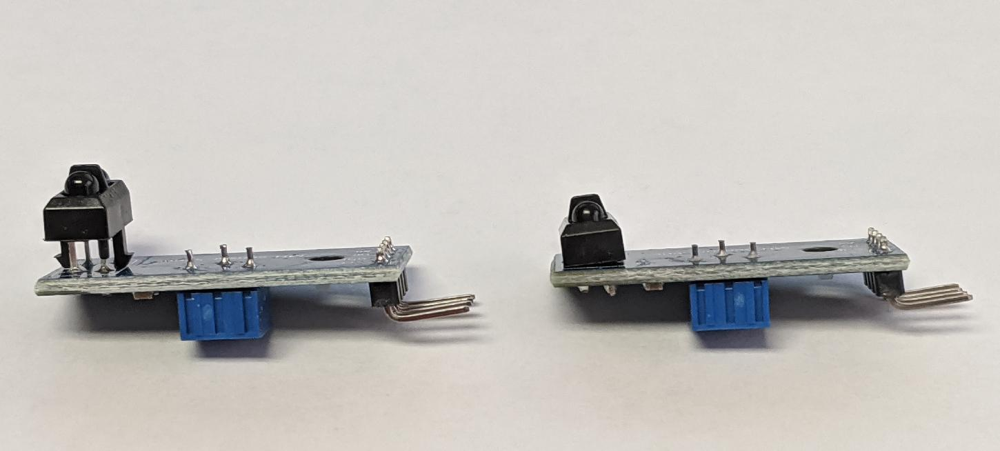
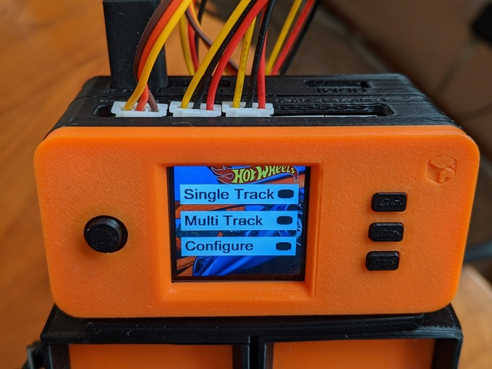
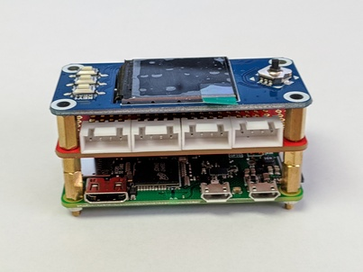
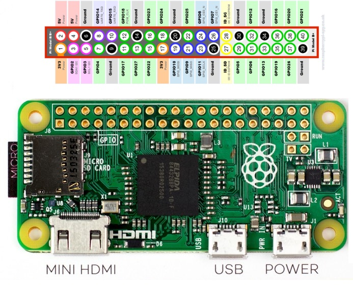
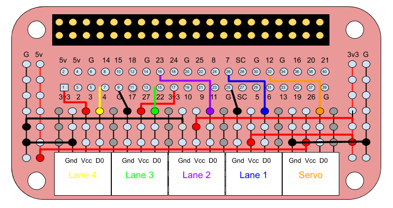
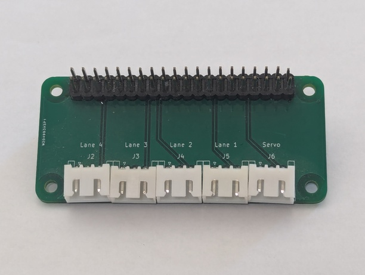
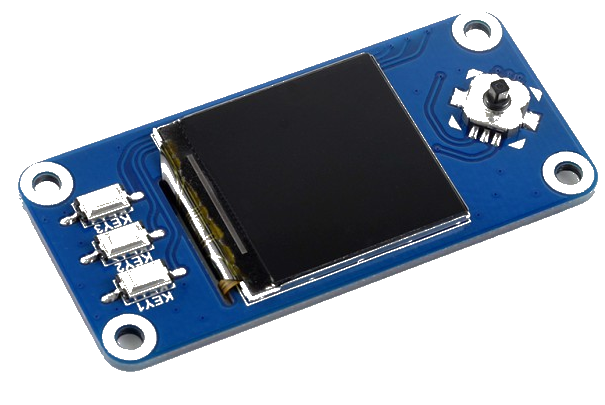

# Diecast Remote Raceway - Starting Gate

This directory contains the 3D models, software and instructions for the Starting Gate component of the Diecast Remote Raceway.


## 3D Printed Components

### Starting Gate

The Starting Gate is derived from the excellent design by 
[capsurfer](https://www.thingiverse.com/capsurfer/about) on 
[Thingiverse](https://www.thingiverse.com/thing:4026846) with a number of modifications to adapt it to automation.

The following components are printed exactly as-is from capsurfer's original design:

* connector_v2.stl
* lever.stl
* lid.stl
* starter.stl
* thestick[\_long4].stl

As they are capsurfer's unmodified designs, I have not included the STL files in this
repository.  You will need to download those STLs from thingiverse.

The following components have been modified to suit automation

* open-box.stl - a modified version of box.stl to insert the track with a mounted sensor from the back of the box. The sensor would collide with the starter if inserted from the front.
* open-box-servo.stl - a modified version of open-box.stl for Lane 1 with an opening and mounting holes for a MG90S servo.
* sensor-track.stl - a modified version of track.stl designed to mount a [TCRT5000 Infrared Reflective Sensor Module](https://www.amazon.com/gp/product/B081RPJ44L) to detect the presence of a car.

* sensor-track-flush.stl - a modified version of sensor-track.stl that moves the sensor forward about 10mm.  Requires reworking the TCRT5000 sensors. See note below.
* servo-knob.stl - Modified version of knob.stl to make the arm much narrower and add holes for the servo control.
* lane-#.stl - modified versions of sensor-track-flush.stl with embossed lane numbers

I also moved the location of the track extrusions that accept the threaded heat set screw inserts further away from the track surface to
eliminate bulging of the track surface. This required changes to both the open-box\* and
sensor-track\* relative to the original they are derived from.

New components added to the design:

* back-lid.stl - a removable lid on the back of the box that secures the track.
* mount.stl - a mount that attaches to the bottom of a box allowing the box to be mounted on a [Hot Wheels Clamp 3-way](https://www.thingiverse.com/thing:4037458) or a [Hot Wheels Track Tripod Connector ](https://www.thingiverse.com/thing:4376073).


#### Note on Track Sensors
With an unmodified IR sensor, the sensor needs to be mounted entirely aft of the starter which leaves very little room for the wiring and puts the sensor at the back bumper of shorter cars.

By reworking the TCRT5000 IR Sensor to mount the LED/Photosensor pair flush with the PCB, the sensor module can be moved forward about 10mm
giving more room for wiring and a better sensing location.  This requires desoldering the LED/Photosensor, clipping the plastic stand-offs
and resoldering the LED and Photosensor after repositioning.  If you aren't comfortable desoldering the LED/Photosensor components, just print the
sensor-track.stl. I felt the relocation was worth the effort of reworking the sensor modules.  I found this inexpensive
[Vacuum Desoldering Iron](https://www.jameco.com/z/VTDESOL3U-Velleman-10-5-Long-Vacuum-Desoldering-Pump-with-30W-Heater-Yellow-_2131021.html)
made the job easy.



An unmodified sensor is shown on the left and a reworked sensor on the right.

#### License

To conform to capsurfer's licensing for the Starter Box from which these components are
derived, the Starting Gate components are released under the [Creative Commons
Attribution - NonCommercial - ShareAlike](https://creativecommons.org/licenses/by-nc-sa/4.0/) license.

### Controller



The control hardware is housed in a three piece case that is based on [JdaieLin](https://github.com/JdaieLin)'s [PiSugar Case](https://github.com/PiSugar/PiSugar).  The controller consists of four 3D printed components:

* bottom-cover.stl - this is an optional bottom cap for use on a completed controller case 
while testing, before mounting to a set of starting gate lanes.  It is based on the PiSugar [pisugar_case_common_cap.STL](https://github.com/PiSugar/PiSugar/blob/master/model/pisugar_case_common_cap.STL) but has been modified to slightly beef up the clips that hold the cap onto the bottom of the pi-zero-case.
* pi-zero-case.stl - a modified version of PiSugar's
[pisugar_nobatt_shell.STL](https://github.com/PiSugar/PiSugar/blob/master/model/pisugar_nobatt_shell.STL) with embossed labels for the exposed ports. The Raspberry Pi Zero board mounts to this case.
* connector-case.stl - case for the Prototyping pHAT or custom PCB with JST connectors. Snaps onto the
pi-zero-case.
* lcd-cap.stl - a slightly modified version of the PiSugar 
[1.3inch_lcd_cap](https://github.com/PiSugar/pisugar-case-pihat-cap/blob/master/1.3inch_lcd_cap/pisugar_case_lcd_cap.STL)
with fillets to beef up the clips.  You will need to print the buttons and joystick cap from
the original design. The file is
[pisugar_case_lcd_button_comp.STL](https://github.com/PiSugar/pisugar-case-pihat-cap/blob/master/1.3inch_lcd_cap/pisugar_case_lcd_button_comp.STL).

* mount.stl - a bracket that screws to the back of lanes 1 & 2 and holds the controller case. The controller snaps onto the mount.

#### License

To conform to [JdaieLin](https://github.com/JdaieLin)'s 
licensing for the PiSugar from which these components are
derived, the Controller case components are released under the 
[GNU General Public License v3.0](https://www.gnu.org/licenses/gpl-3.0.en.html).

## Hardware

The Controller electronics is comprised of a stack of 3 circuit boards: a Raspberry Pi Zero W (or Zero 2 W), a custom Connector Breakout Board that the servo and lane sensors plug into, and a Waveshare 1.3" LCD Hat for input and display.



### Raspberry Pi Zero

The Starting Gate is controlled by a Raspberry Pi Zero W.  These are available for about $10 without the GPIO header or about $15 for the Pi Zero WH model with preinstalled GPIO headers.



#### GPIO Usage

| SYMBOL | BROADCOM GPIO (BCM) | RASPBERRY PI PIN | DESCRIPTION |
|:------:|:-------------------:|:----------------:|:-----------:|
| KEY1 | GPIO21 | 40 | Button 1/GPIO |
| KEY2 | GPIO20 | 38 | Button 2/GPIO |
| KEY3 | GPIO16 | 36 | Button 3/GPIO |
| Joystick Up | GPIO6 | 31 | Joystick Up |
| Joystick Down | GPIO19 | 35 | Joystick Down |
| Joystick Left | GPIO5 | 29 | Joystick Left |
| Joystick Right | GPIO26 | 37 | Joystick Right |
| Joystick Press | GPIO13 | 33 | Joystick Press |
| SCLK | GPIO11/SCLK | 23 | SPI clock input |
| MOSI | GPIO10/MOSI | 19 | SPI data input |
| DC | GPIO25 | 22 | Data/Command selection (high for data, low for command) |
| CS | GPIO8/CE0 | 24 | Chip selection, low active |
| RST | GPIO27 | 13 | Reset, low active |
| BL | GPIO24 | 18 | Backlight |
| Servo | GPIO12 (PWM0) | 32 | Servo |
| LANE1 | GPIO7 | 26 | Lane 1 Sensor |
| LANE2 | GPIO23 | 16 | Lane 2 Sensor |
| LANE3 | GPIO22 | 15 | Lane 3 Sensor |
| LANE4 | GPIO4 | 7 | Lane 4 Sensor |


### Connector Breakout Board

The Connector Breakout Board (CBB) connects to the Raspberry Pi GPIO connector and provides JST connectors to plug in the servo and lane sensors. There are
two options for the CBB: use a commercially available ModMyPi Zero Prototying pHat and solder jumper wires to create the necessary circuit, or use the
provided Gerber files to have a custom PCB printed. The PCB solution involves less soldering and is cleaner, but requires you to have the PCBs
fabricated.  I used [PCBWay](https://www.pcbway.com/).  I still have a few of the blank PCBs.  If you are seriously building a DRR, reach out to me and
I can mail you one.

#### Prototyping pHAT Schematic

Connections to the car release servo and lane car sensors
are made via JST connectors soldered to a [ModMyPi Zero Prototyping
pHAT.](https://www.pishop.us/product/zero-prototyping-phat-zero/). The
schematic is shown below.



#### Custom PCB

The Gerber files for the CBB HAT can be found in the gerber folder.



### Waveshare 1.3" LED HAT

The Waveshare 1.3" LCD HAT provide three button input and a joystick for navigation.  The race state and results are shown on the display.



## Software

The Starting Gate consists of the following components

* drr\_wrapper.py called from /etc/rc.init at boot, checks for software updates and runs starting\_gate.py as a child process.  If starting\_gate.py fails for any reason, it is restarted
* starting\_gate.py is the executable for the starting gate. It displays the initial menu and runs races

* config.py manages confiuration settings
* coordinator.py interface to the Race Coordinator server when running multi-track races
* deviceio.py interface to WaveShare 1.3" LCD buttons, servo and GPIO PINs for sensing cars
* display.py manages the race display
* input.py accepts user input via character selection from a grid
* menu.py manages the top level menu and all configuration menues

## Raspberry Pi Setup

### Install Raspberry PI OS

The DRR software writes directly to the framebuffer and does not need a desktop OS image.

I strongly recommend you install via the [Raspberry Pi Imager](https://www.raspberrypi.com/software/).  You will need a minimum 8GB microSDHC card.
Insert the card into an appropriate card reader on your computer.

Run the Raspberry Pi Imager and select your board.

1.  Click on "CHOOSE DEVICE" and select either the "Raspberry Pi Zero W" or "Raspberry Pi Zerro 2 W" depending in which board you are using.
1.  Click on "CHOOSE OS" and select "Raspberry Pi OS (other)" then "Rasboerry Pi OS Lite (32-bit)"
1.  Click on "CHOOSE STORAGE" and select the appropriate option for the storage card you are initializing
1.  Click on "NEXT" and when asked to apply OS customisation settings, click "EDIT SETTINGS"
    * Under "General," provide a hostname, username and password, LAN configuration and Locale settings.
    * Under "Services" enable SSH.
1.  After editing settings, click on "YES"
1.  Click on "YES" to write the OS image to your SD card

Once your SD card is initialized insert it into your Raspberry Pi Zero.  You can either connect a keyboard and monitor or just SSH into the device when it
boots. Log in using the username and password you created when running the Raspberry Pi Imager.

Once logged in, I recommend you upgrade any packages:

```
sudo apt update
sudo apt upgrade
```

### Setup the Waveshare 1.3" LCD HAT

Raspberry OS Bookworm has native support for the st7799 display driver chip.  There is no need to follow the instructions from the [Waveshare
Wiki](https://www.waveshare.com/wiki/1.3inch_LCD_HAT). The shell script `setup-waveshare-1.3-HAT.sh` in the util subdirectory will perform all necessary changes to a base Raspberry OS system.

```
wget https://raw.githubusercontent.com/tquiggle/Diecast-Remote-Raceway/refs/heads/master/StartingGate/util/setup-waveshare-1.3-HAT.sh
chmod 755 setup-waveshare-1.3-HAT.sh 
sudo ./setup-waveshare-1.3-HAT.sh
```

### Install Python 3 and the necessary libraries

1. Install the necessary prerequisites:

    ```
    sudo apt install -y cmake git python3 python3-gpiozero python3-pigpio python3-bluez python3-pip libegl1-mesa-dev libgbm-dev libgles2-mesa-dev libdrm-dev
    ```

1.  Have pigpiod start on every boot

    ```
    sudo systemctl enable pigpiod
    ```

### Build the 32 bit DRM version of Raylib

This mostly follows the instructions at the [Python Bindings for Raylib 5.5](https://electronstudio.github.io/raylib-python-cffi/README.html) Github page for [Compile Raylib from source DRM mode](https://electronstudio.github.io/raylib-python-cffi/RPI.html#option-3-compile-raylib-from-source-drm-mode) for the Raspberry Pi.

1. Build a shared lib version of Raylib in DRM mode and install to /usr:

    ```
    git clone https://github.com/raysan5/raylib.git --branch 5.0 --single-branch
    cd raylib
    mkdir build
    rm rf build/*
    cd build
    cmake -DPLATFORM="DRM" -DBUILD_EXAMPLES=OFF -DCUSTOMIZE_BUILD=ON -DSUPPORT_FILEFORMAT_JPG=ON -DSUPPORT_FILEFORMAT_FLAC=ON -DCMAKE_BUILD_TYPE=Release -DBUILD_SHARED_LIBS=ON -DCMAKE_INSTALL_PREFIX:PATH=/usr ..
    make -j
    sudo make install
    ```

1. Then have pip compile and install the wheel for the python bindings:

    ```
    python3 -m pip install --break-system-packages setuptools
    python3 -m pip install --no-cache-dir --no-binary raylib --upgrade --force-reinstall --break-system-packages raylib==5.5.0.0
    ```

That's it, you sould be able to run the DRR python application.

